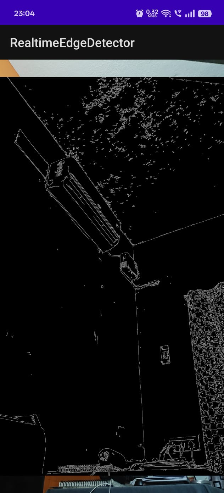
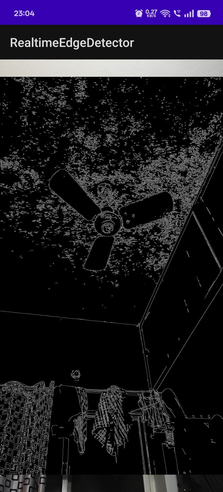
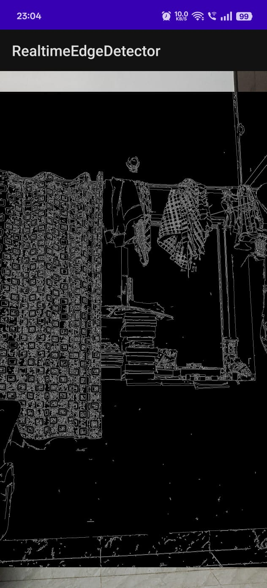
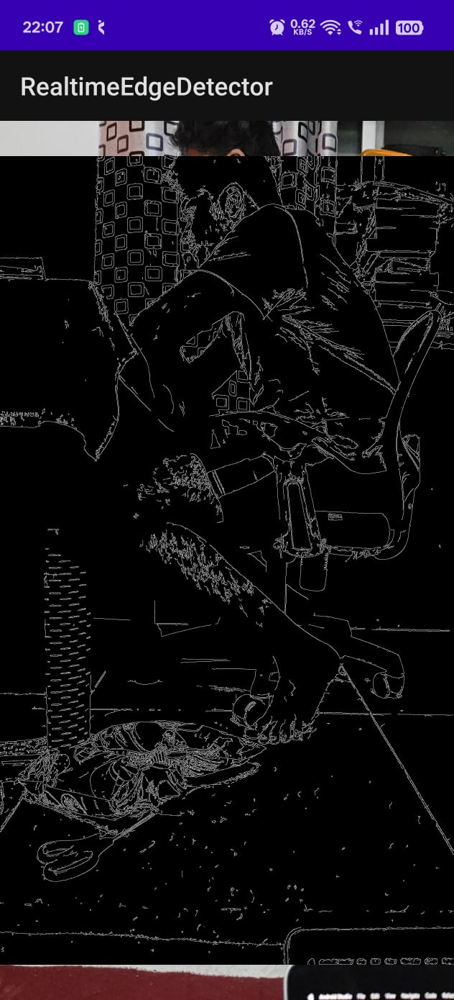

# Real-time Edge Detection Viewer

This project is a submission for a technical assessment for an R&D Intern position. It is an Android application that captures a live camera feed, performs real-time Canny edge detection using OpenCV in C++, and renders the output at high performance using OpenGL ES 2.0.

The project also includes a minimal TypeScript-based web viewer to demonstrate the ability to display processed output on a web layer.

## ✅ Features Implemented

### Android Application
*   **Live Camera Feed:** Captures frames from the device's camera using the Camera1 API.
*   **Native C++ Processing:** Each camera frame is passed from Java to C++ via the Java Native Interface (JNI).
*   **OpenCV Edge Detection:** In the C++ layer, the raw YUV frame is converted to grayscale, and a Canny edge detection algorithm is applied.
*   **OpenGL ES 2.0 Rendering:** The final black-and-white edge-detected image is rendered to the screen as a texture using OpenGL ES 2.0 for smooth, real-time performance.
*   **Correct Orientation:** Both the camera preview and the final rendered output are correctly rotated for a portrait display.

### Web Viewer
*   **Static Frame Display:** A minimal HTML and TypeScript webpage displays a static, Base64-encoded sample image.
*   **DOM Manipulation:** TypeScript is used to set the image source and update a text overlay with sample frame statistics (FPS, resolution).
*   **TypeScript Compilation:** The web component is fully buildable using the `tsc` compiler.

## 📷 Screenshots

Here are screenshots showcasing the project's functionality and structure.

**Live Edge Detection on Android:**

**Web Viewer Component:**

**Code Structure and Implementation:**

**Final Application in Action:**

## ⚙️ Setup Instructions

### Prerequisites
*   Android Studio
*   Android NDK (installed via Android Studio's SDK Manager)
*   An Android device with camera access

### Dependencies
1.  **OpenCV for Android SDK:** This project requires the OpenCV for Android SDK.
    *   Download the SDK from the [OpenCV Releases Page](https://opencv.org/releases/).
    *   Unzip the SDK to a known location on your computer.
2.  **Update Local Path:**
    *   Open the file `/app/src/main/cpp/CMakeLists.txt`.
    *   On line 6, update the `set(OpenCV_DIR ...)` command to point to the `sdk/native/jni` folder within the location where you unzipped the OpenCV SDK.
    *   Example: `set(OpenCV_DIR "C:/Libraries/OpenCV-4.x.x-android-sdk/sdk/native/jni")`

After updating the path, sync Gradle, and the project will be ready to build and run.

## 🧠 Architecture Explanation

### Android Frame Flow
1.  **Camera Capture (`MainActivity.java`):** An instance of `android.hardware.Camera` is created. A `PreviewCallback` is set up to receive raw frame data as a `byte[]` in NV21 format.
2.  **JNI Call (`NativeBridge.java`):** For each frame, the `byte[]` data, along with its width and height, is passed to a static native method: `NativeBridge.processFrame()`.
3.  **C++ Processing (`native-lib.cpp`):**
    *   The JNI function receives the `jbyteArray` and converts it into an OpenCV `cv::Mat`. The Y-plane of the NV21 data is used directly as the grayscale image.
    *   `cv::Canny()` is applied to this grayscale `Mat` to produce a `Mat` containing the edges.
    *   The frame is rotated 90 degrees using `cv::rotate()` to correct for the camera sensor's landscape orientation.
    *   `cv::cvtColor()` is used to convert the single-channel edge `Mat` into a 4-channel RGBA `Mat`.
4.  **OpenGL Rendering (`EdgeRenderer.cpp`):**
    *   The final RGBA `Mat` is passed to a dedicated `EdgeRenderer` class.
    *   In the `onDrawFrame()` call (triggered by the Java `GLSurfaceView`), the renderer uploads the pixel data from the `Mat` to an OpenGL texture using `glTexImage2D()`.
    *   This texture is then drawn onto a simple quad that fills the screen, resulting in a high-performance video feed of the processed frames.

### TypeScript Web Viewer
The web viewer is located in the `/web` directory and is a self-contained component.
*   `index.html` provides the basic structure, including an `` tag for the frame and a `
` tag for stats.
*   `main.ts` contains the logic. It gets the HTML elements by ID and uses DOM manipulation to set the `src` of the image to a hardcoded Base64 string and update the text content of the stats element. This demonstrates a basic understanding of TypeScript project setup and its interaction with a webpage.
